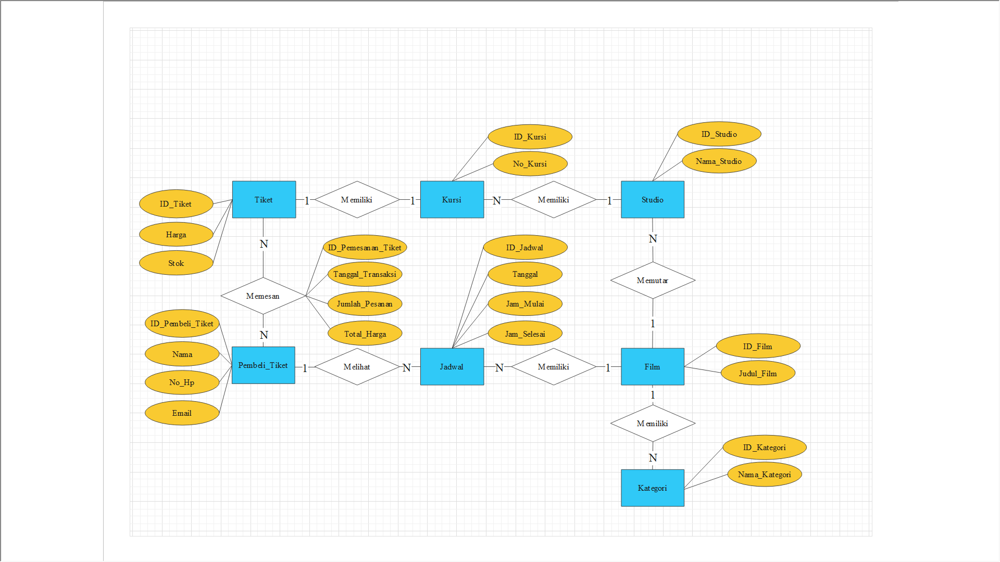

# Pemesanan Tiket Bioksop (Online)

### Alur pemebelian tiket secara online

### Entitas
1. Pemesan Tiket
2. Film
3. Kategori FIlm
4. Tiket
5. Jadwal
6. Kursi
7. Studio
8. Data Pesanan Tiket

### Atribut
1. Pemesan Tiket
- ID_Pemesan : ID untuk pemesan (integer) (PK)
- Nama : Nama lengkap pemesan (varchar)
- No_Hp : No telepon pemesan (integer)
- Email : Email pemesan (varchar)

2. Film
- ID_Film : ID untuk Film (varchar) (PK)
- Judul_Film : judul lengkap film (varchar)

3. Tiket
- ID_Tiket : ID untuk tiket (integer) (PK)
- Harga : Harga satuan tiket (integer)
- Stok : Jumlah Stok yang tersedia (varchar)

4. Jadwal
- ID_Jadwal : ID untuk jadwal film (varchar) (PK)
- Tanggal : Tanggal tayang film (date)
- Jam_mulai : Jam mulai pemutaran film (time)
- Jam_Berakhir: Jam berakhir pemutaran film (time)

5. Kursi 
- ID_Kursi : ID untuk kursi (varchar) (PK)
- No_kursi : Nomor kursi (varchar)

6. Studio
- ID_Studio : ID untuk studio (integer) (PK)
- Nama_Studio : Nama untuk studio (varchar)

7. Kategori
- ID_Kategori : ID untuk kategori film (integer) (PK)
- Nama_Kategori : Nama kategori (varchar)

8. Daftar Pesanan Tiket
- ID_Pemesanan : ID untuk transaksi pemesanan tiket (integer) (PK)
- Tanggal_Pemesanan : Tanggal transaksi pemesanan tiket (date)
- Jumlah_Tiket :Jumlah tiket yang dipesan (integer)
- Total_Harga : Total Harga yang harus dibayar (integer)

### ERD

